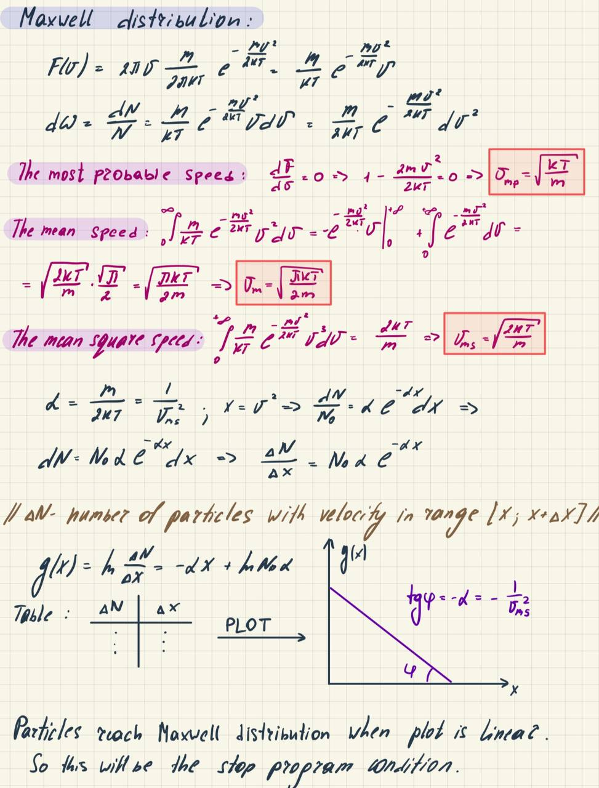
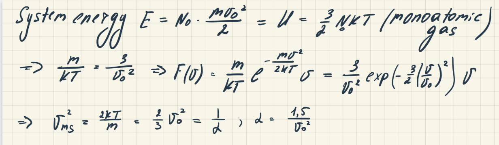
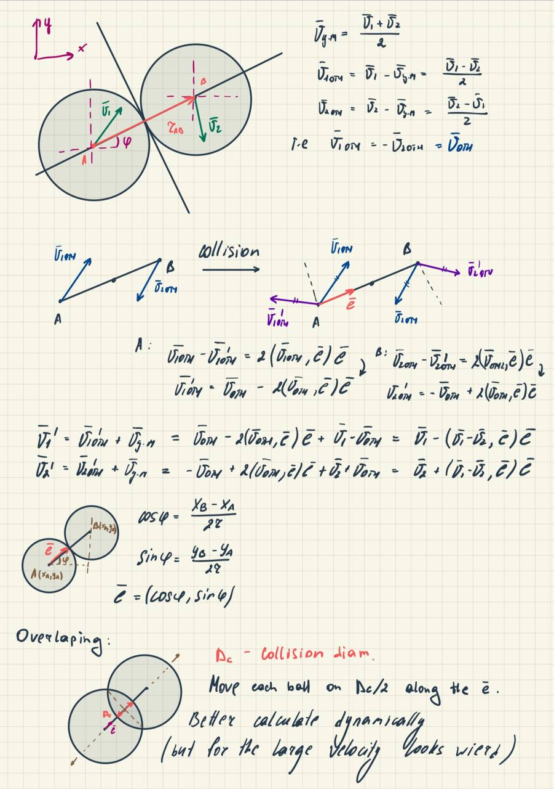
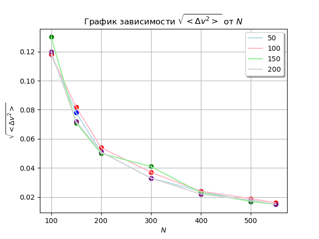
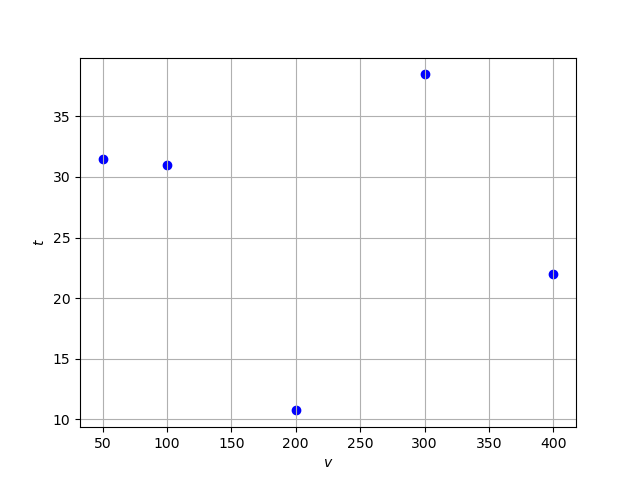

# Maxwell Distribution Analysis
This project was made to study particle collisions and their Maxwell Distribution.
Starting to move at the same speed in a random directions, the particles
should come to a Maxwell velocity Distribution after some time. 
So the aim is to calculate that time, considering starting conditions (velocity, 
number of particles, Distribution density).


## Theory

Here some theoretical information:




## Stop program condition 
Apparently particles come to Maxwell Distribution somehow quickly.
So we can set fault and continue measuring time till calculated fault is less than the set one.

## Some results
While calculating the time I noticed that mean square error of the square of velocity somehow depends on the starting conditions like N - number of particles and 
v_0 - starting velocity. After collecting and researching some data (all calculations is in the ErrorDependency.ipynb file) I came to conclusion that this error does not depend on the speed but rather on number of particles. Here some plots that confirm my results.



Now as we know that error does not depend on velocity lets measure time during which particles come to maxwell Distribution as following. Take particular number of particles and depending on velocity measure time when for a long time error is less then average error for the number of particles.

As a result calculated time is always different even for the same velocity. So there is seem to be no correlation between time and speed.


## Installation
#### Requirements
Some libraries: [mathGL](https://mathgl.sourceforge.net/doc_en/Main.html), [raylib](https://www.raylib.com/index.html), my own error managing lib that is already
in code as a submodule.
````bash
make
./maxwell
