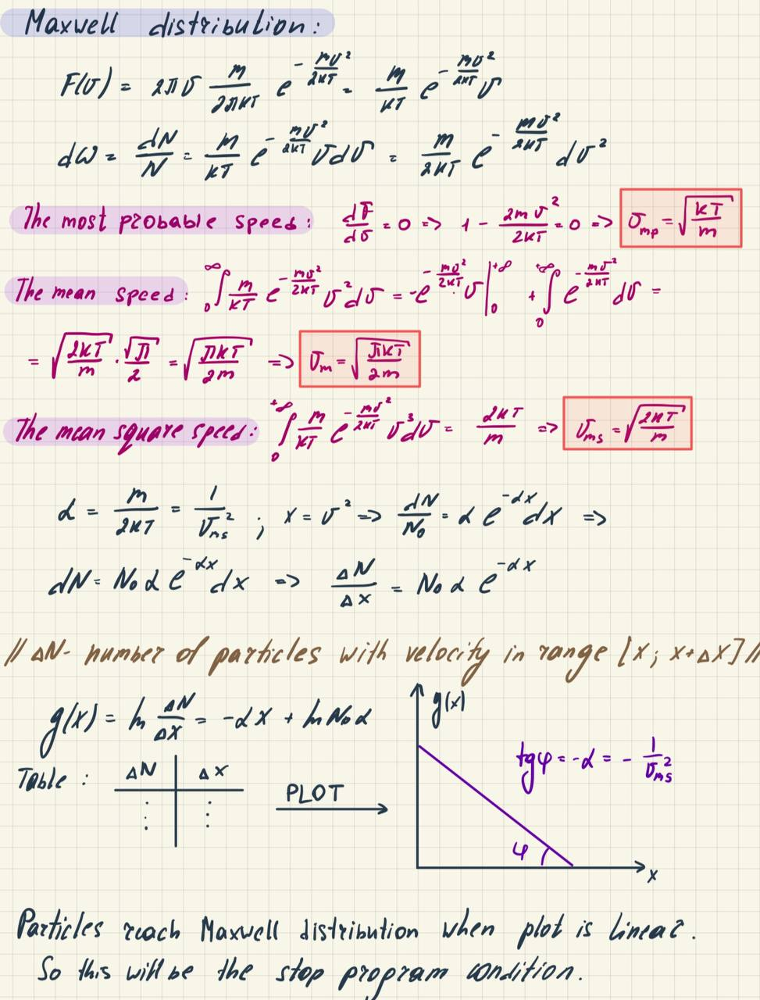
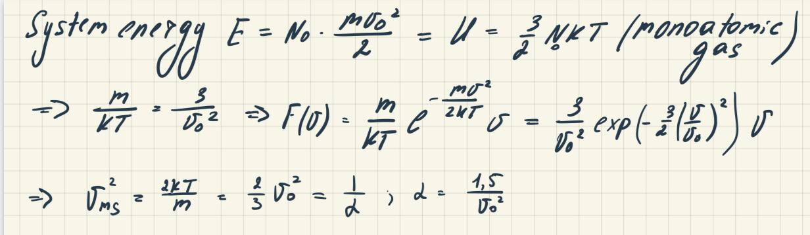
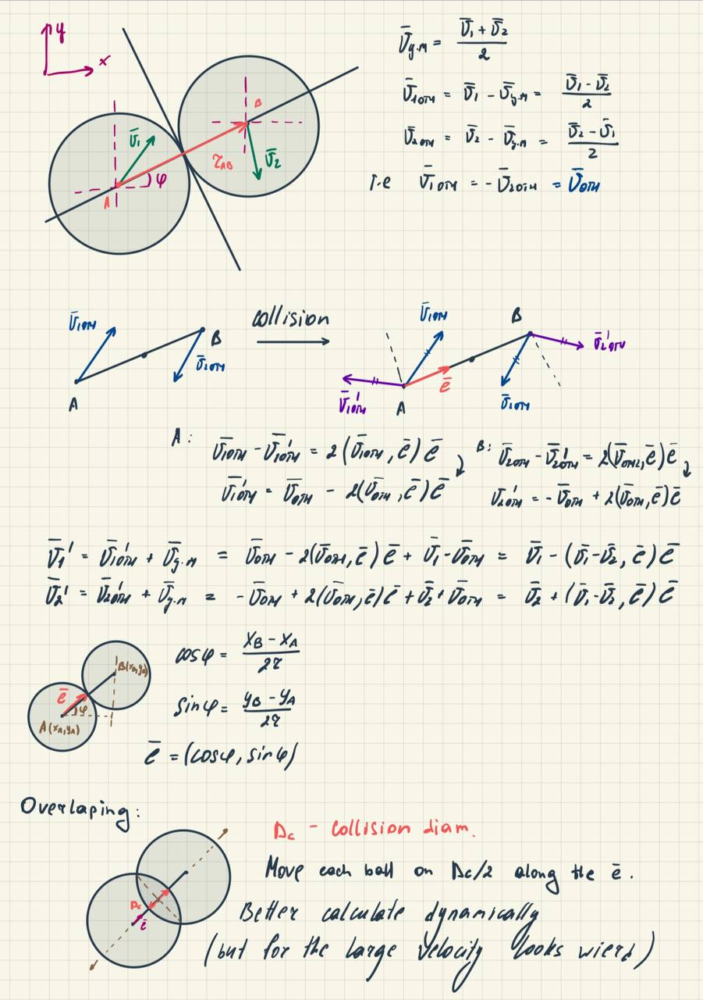

# Maxwell Distribution Analysis
This project was made to study particle collisions and their Maxwell Distribution.
Starting to move at the same speed in a random directions, the particles
should come to a Maxwell velocity Distribution after some time. 
So the aim is to calculate that time, considering starting conditions (velocity, 
number of particles, Distribution density).

## Theory

Here some theoretical information:

